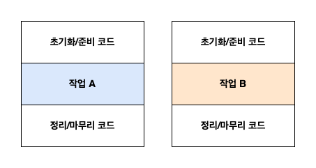

## 람다란 ?

- 람다 표현식은 메서드로 전달할 수 있는 익명 함수를 단순화한 것이다.  
- 파라미터 리스트, 바디, 반환 형식, 발생할 수 있는 예외 리스트를 가질 수 있다.  
- 함수형 인터페이스는 람다 표현식과 함께 자주 사용되며, 이를 통해 추상 메서드를 직접 구현할 수 있다.  
- 이렇게 구현된 람다 표현식은 함수형 인터페이스의 인스턴스로 취급된다.

> **함수형 인터페이스**  
> 하나의 추상 메서드를 지정하는 인터페이스 (Comparator, Runnable 등)  
> **@FunctionalInterface**로 인터페이스를 선언했지만, 실제로 함수형 인터페이스가 아니라면 컴파일러가 에러를 발생시킨다.

> **함수형 디스크립터**  
> 람다 표현식의 시그니처를 서술하는 메서드를 함수 디스크립터라고 한다.  
> 예를 들어, Runnable의 추상 메서드 run은 인수와 반환값이 없으므로 시그니처가 없다고 볼 수 있다.

## 람다 활용 - 실행 어라운드 패턴

- 자원을 처리하는 코드는 보통 자원을 열고, 처리한 다음에, 자원을 닫는 순서로 이루어진다.  
- 그래서 코드는 설정과 정리 두 과정이 둘러싸는 형태(실행 어라운드 패턴)를 갖는다.



기존의 설정, 정리 과정은 재사용하고 processFile만 다양한 동작을 수행할 수 있도록 한다.

1. (BufferedReader -> String) 시그니처와 일치하는 함수형 인터페이스를 만든다.
2. BufferedReaderProcessor 객체의 process로 동작을 실행한다.
3. 람다를 이용하여 다양한 동작을 전달한다. (BufferedReader br) -> br.readLine() + br.readLine()

```java
    public static String processFile(BufferedReaderProcessor p) throws IOException {
        try (BufferedReader br = new BufferedReader(new FileReader("data.txt"))) {
            return p.process(br);
        }
    }

    public interface BufferedReaderProcessor {
        String process(BufferedReader br) throws IOException;
    }
    
    String twoLines = processFile((BufferedReader br) -> br.readLine() + br.readLine());
```


## 컴파일러의 동작

### 형식 검사

- 람다가 사용되는 context를 이용해서 람다의 type을 추론한다.
- 람다가 전달될 메서드 파라미터나 할당되는 변수 등 기대되는 람다 표현식의 형식을 대상 형식이라고 한다.
- 하나의 람다 표현식은 특정 함수형 인터페이스의 대상 형식으로 사용되며, 같은 본문을 가진다면 여러 함수형 인터페이스에서 사용될 수 있다.

### 형식 추론

- 대상 형식을 이용해 함수 디스크립터를 알 수 있으므로, 컴파일러는 람다의 시그니처도 추론할 수 있다.
- 결과적으로 람다 파라미터 형식에 접근하기 떄문에 이를 생략하여 단순화 시킬 수 있다.
- 정해진 규칙은 없기 때문에 개발자 스스로 어떤 코드가 가독성을 향상시킬 수 있는지 판단해야 한다.

```java
    Comparator<Apple> c1 = (Apple a1, Apple a2) -> a1.getWeight().compareTo(a2.getWeight());
    Comparator<Apple> c2 = (a1, a2) -> a1.getWeight().compareTo(a2.getWeight());
```

### 제약

- 람다 표현식에서는 익명 함수가 하는 것처럼 외부에서 정의된 변수(자유 변수)를 활용할 수 있다. (람다 캡처링)
- 사용하는 자유 변수는 final로 선언되거나 final 형식처럼 사용되어야 한다.
- 내부적으로 인스턴스 변수는 힙에 저장되고, 지역 변수는 스택에 저장된다.
- 람다 표현식은 자유 지역 변수의 복사본을 제공하므로, 복사본의 값이 바뀌지 않도록 값을 한 번만 할당해야 한다.

## 메서드 참조

- 메서드 참조는 메서드를 어떻게 호출해야 하는지 설명을 참조하기보다는 메서드명을 직접 참조하는 것이다.  
- 실제로 메서드 참조를 활용하면 기존 메서드 구현으로 람다 표현식을 작성하여 가독성을 높일 수 있다.
- 컴파일러는 형식을 검사하는 방식과 같이 메서드 참조가 주어진 함수형 인터페이스와 호환하는지 확인한다.

```java
    ToIntFunction<String> stringToInt1 = (String s) -> Integer.parseInt(s);
    ToIntFunction<String> stringToInt2 = Integer::parseInt;
        
    BiPredicate<List<String>, String> contains1 = (list, element) -> list.contains(element);
    BiPredicate<List<String>, String> contains2 = List::contains;
        
    Predicate<String> startsWithNumber1 = (String s) -> this.startsWithNumber(s);
    Predicate<String> startsWithNumber2 = this::startsWithNumber;
```

### 생성자 참조

- Class::new처럼 클래스명과 new 키워드를 이용해서 기존 생성자의 참조를 만들 수 있다.
- 또한 인스턴스화하지 않고도 생성자에 접근할 수 있다.

```java
    // 인수가 없는 생성자
    Supplier<Apple> c1 = Apple::new;
    Apple a1 = c1.get();
    
    // 인수가 1개인 생성자
    Function<Integer, Apple> c2 = Apple::new;
    Apple a2 = c2.apply(100);
    
    // 인수가 2개인 생성자
    BiFunction<Color, Integer, Apple> c3 = Apple::new;
    Apple a3 = c3.apply(Color.GREEN, 100);
    
    // 인스턴스화 없이 생성자에 접근
    Map<String, Function<Integer, Fruit>> map = new HashMap<>();
    map.put("apple", Apple::new);
    map.put("orange", Orange::new);

    public static Fruit giveMeFruit(String fruit, Integer weight) {
        return map.get(fruit.toLowerCase())
                .apply(weight);
    }
```

## 람다, 메서드 참조 활용

```java
    // 1단계: 코드 전달
    public class AppleComparator implements Comparator<Apple> {
        public int compare(Apple a1, Apple a2) {
            return a1.getWeight().compareTo(a2.getWeight());
        }
    }
    inventory.sort(new AppleComparator());
    
    // 2단계: 익명 클래스 사용
    inventory.sort(new Comparator<Apple>() {
        @Override
        public int compare(Apple a1, Apple a2) {
            return a1.getWeight().compareTo(a2.getWeight());
        }
    });
    
    // 3단계: 람다 표현식 사용
    inventory.sort((Apple a1, Apple a2) -> a1.getWeight().compareTo(a2.getWeight()));
    
    // 4단계: 메서드 참조 사용
    inventory.sort(Comparator.comparing(Apple::getWeight));
```

## 람다 표현식의 조합

- 여러 개의 람다 표현식을 조합해서 복잡한 람다 표현식을 만들 수 있다.
- default method로 추가 메서드를 제공하기 때문에 함수형 인터페이스의 정의에 어긋나지 않는다.

```java
    // 내림차순 정렬, 무게가 같으면 국가별로 정렬
    inventory.sort(Comparator.comparing(Apple::getWeight)
        .reversed()
        .thenComparing(Apple::getCountry));
    
    // 빨간색 사과
    Predicate<Apple> redApple = apple -> Color.RED.equals(apple.getColor());
    
    // 빨간색이 아닌 사과
    Predicate<Apple> notRedApple = redApple.negate();
    
    // 빨간색이면서 무거운 사과 또는 녹색 사과
    Predicate<Apple> redAndHeavyOrGreen =
        redApple.and(apple -> apple.getWeight() > 150)
                .or(apple -> Color.GREEN.equals(apple.getColor()));
    
    Function<Integer, Integer> f = x -> x + 1;
    Function<Integer, Integer> g = x -> x * 2;
    Function<Integer, Integer> h1 = f.andThen(g);
    Function<Integer, Integer> h2 = f.compose(g);
    int result1 = h1.apply(1); // g(f(x)), 4를 반환
    int result2 = h2.apply(1); // f(g(x)), 3을 반환
```
